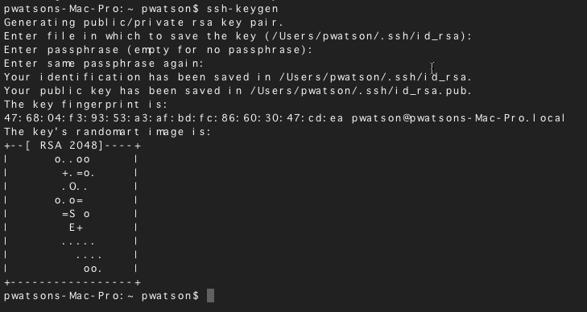

# Connecting Windows Linux

## Connect to Samba Share

Just like the network other drives, `K drive` for example, we can connect to
linux and bring up its hard drive. This will allow us to drag/drop code on
the linux system and edit it.

Using this method requires Windows to understand the zeroconfig protocol
linux uses. The **only** way I know how to do this is to install 
[*iTunes*](https://www.apple.com/itunes/download/). If
you don't do this, then the only way to connect to linux is to know its
IP address and use that number instead. Maybe someone else can login and
tell you what it is, however, since the IP addresses are served up via
[DHCP](https://en.wikipedia.org/wiki/Dynamic_Host_Configuration_Protocol), 
they will change from time to time.

1. Click the **Start** button and select **Computer**
2. Click **Map a network drive** on the top toolbar

3. Enter the share name: `\\robot_name.local\pi`
    1. Make sure to check the box **Connect using different credentials**
    

4. Click **Finish**
5. Input *username* and *password*

## Disconnect from Samba Share

1. Click the **Start** button and select **Computer**
2. Right click on share
3. Select **Disconnect** from menu

## Getting Access to the Command Line

To navigate linux, you need access to the command line. The only way to do that
is to use [secure shell](https://en.wikipedia.org/wiki/Secure_Shell) (ssh). This 
process is going to allow you to login without
having to always supply a *username* and *password*. We will first create an
[RSA digital certificate](https://en.wikipedia.org/wiki/Public-key_cryptography)
(or pubic/private keys) and then install that cert on the robot.

The process will look similar to the screenshot below.

1. Download and install [GitBash](https://git-scm.com/downloads) (this gives you everything you need)
2. Open a terminal window and navigate to your home directory, `cd ~`
3. Then generate an encrypted certificate with: `ssh-keygen.exe`. Just accept
   the default values and use an empty pass phrase (yes, not the most secure, but oh well ...)
4. Next we have to send that over to our linux system: `ssh-copy-id pi@robot_name.local`.
   Accept anything that pops up. You will need to put in the *username* and *password*
   to authenticate you can add this digital cert to the system.
5. Now test it out: `ssh pi@robot_name.local`. It should log you directly into
   the robot, your authentication is handled via [Diffie–Hellman](https://en.wikipedia.org/wiki/Diffie%E2%80%93Hellman_key_exchange)
   protocol and the certificate we just created.
