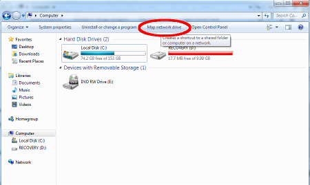
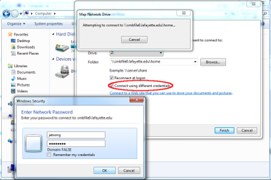
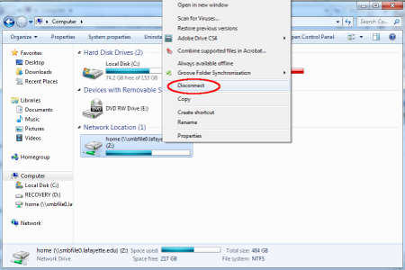

# Connecting to a Samba Share on Linux

Just like the network other drives, `K drive` for example, we can connet to
linux and bring up its hard drive. This will allow us to drag/drop code on
the linux system and edit it.

Using this method requires Windows to understand the zeroconfig protocol
linux uses. The **only** way I know how to do this is to install *iTunes*.

## Connect to Samba Share

1. Click the **Start** button and select **Computer**
2. Click **Map a network drive** on the top toolbar

3. Enter the share name: `\\robot_name.local\pi`
    1. Make sure to check the box **Connect using different credentials**
    

4. Click **Finish**
5. Input *username* and *password*

## Disconnect from Samba Share

1. Click the **Start** button and select **Computer**
2. Right click on share
3. Select **Disconnect** from menu
