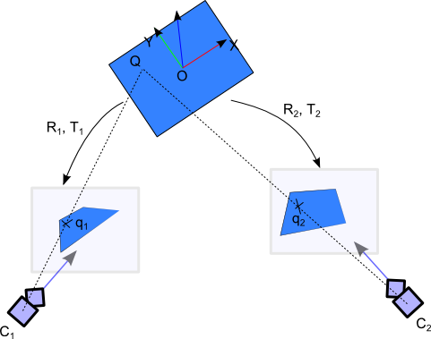

http://iplimage.com/blog/p3p-perspective-point-overview/

# Homography

http://iplimage.com/blog/geom-computing-homography-views/

Homography is the process of finding a transform between two different camera
scenes. Given two images of the same scene (say $q_1$ and $q_2$), we want to
find the affine transformations (rotation and translation) of this scene which
will give us q1 and q2.

$$
\begin{bmatrix}
  q_i \\
  1
\end{bmatrix}_C
=
\begin{bmatrix}
  K_i & 0
\end{bmatrix}
\begin{bmatrix}
  R_i & t_i \\
  0_{3x3} & 1
\end{bmatrix}
\begin{bmatrix}
  Q_{1x3} \\
  1
\end{bmatrix}
$$

where

$$
K_i =
\begin{bmatrix}
  f & 0 & c_x \\
  0 & f & c_y \\
  0 & 0 & 1
\end{bmatrix}
$$

**add the special case**

# QR

http://iplimage.com/blog/quick-response-code-qr-code/

History of the QR Code: The QR Code was invented and patented by Denso-Wave in 1994 to enhance the quality of the control of the Toyota production.

The QR Code was published as under “Open Standard” in 1999 by Denso-Wave. As a consequence, it has a huge success in Japan and more recently in other countries.

# Image Recog

http://iplimage.com/blog/image-recognition-short-evaluation/

# Markers

## Process

http://iplimage.com/blog/cv-img-tec-black-white-marker-detection/

1. Provide an algorithm that can detect image edges/borders. Usually we can select one of the following option (according to the robustness we want to reach):
    1. Simple Threshold method (fast but not robust to lightening variations),
    1. Canny Threshold method (quite expensive in terms of CPU usage, but more robust)
    1. Adaptive Threshold method (which is an extension of the simple threshold principle using neighboring pixels to find the correct value of the threshold).
    1. Others
    1. These functions are available in OpenCV (cvAdaptiveThreshold, cvCanny, …) and quite well optimized.
1. Convert bordering pixels into polygons (OpenCV : cvFindContour), and find outer polygons (inner polygons should be inside the black and white marker) that contains 4 segments exactly.
1. For each polygon in the list of candidates:
    1. Project the current polygon into a square (projective reprojection).
    1. Verify that there is a black border around the center area of the marker.
    1. Try to identify the code contained inside the marker.
1. Once the marker is identified, it is possible to estimate its position and orientation (also named pose) according to the camera reference. To do that, there exists multiple possibilities:
    1. Estimate the exact marker pose by solving a polynomial equation. This equation needs 3 points and can result in zero, ideally one or up to four solutions. Usually, the 4th point is used to find the best solution by projecting its 3D coordinates on the image plane using previous pose estimation and camera calibration estimation. The distance between this projected 2D point and the real coordinates measure an error that we wish to minimize. The problem with this technique is that there is no exact solution because the calibration is always an approximation of the real world projective information. Thus the resulting pose becomes a bad approximation and a “jitter” effect appears on the frame to frame process.
    1. As the first solution only give an exact solution considering 3 points. We explore here a non-exact solution that can be obtained by optimizing a projection distance using the 4 points given by the principle. To do that we can use a standard Gauss Newton algorithm (or a Gauss Newton based Levenberg-Marquardt algorithm to avoid strange parallax inversions when the previous 4 possible exact solutions are close to each other). Notice that once again, OpenCV provides functions to resolve this kind of equations (see `cvFindExtrinsicParams` for more information).
