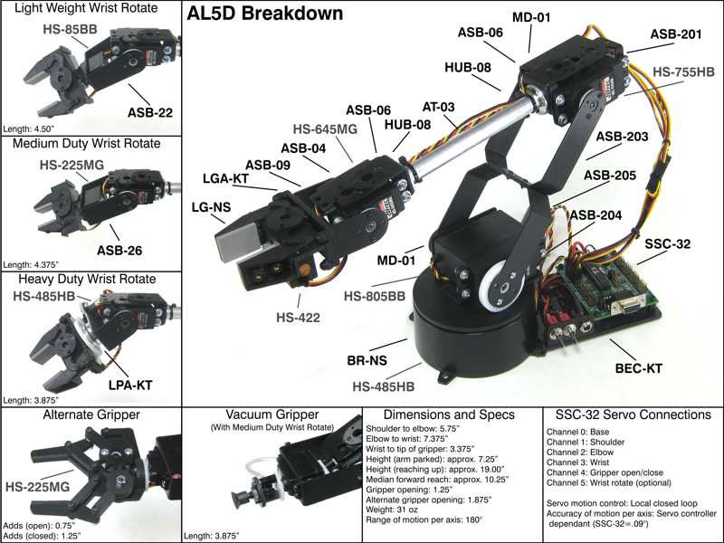
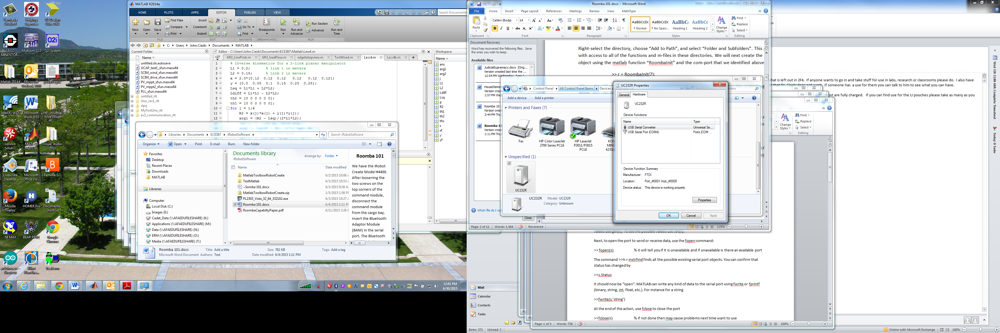

# Robot Arm

In this lab we will make the robot arm move through a predefined sequence of
movements. Utilizing the work you already did in homework, you will make the
arm move.

You should learn or gain experience with:

- Taking to an actuator via a common serial port
- Translate forward/inverse kinematics theory into reality with a real robot arm
- Understand how to translate angles to PWM servo commands
- Gain more experience with Python

## Setup

{width=75%}

The arm is equipped with 5 servos and the distance between are given in the figure
above. The arm connects to your laptop via a USB-to-Serial connector shown below.


### Baudrate

If you have one of the newer arms (they don't have the blue/white USB-to-serial
converter), you may have to toggle your baud rate to 115kbps. The SSC-32U is
shipped with a default Baud rate of 9600. It also supports setting Baud rate
using the onboard push button. To set the Baud rate:

1. Press and hold the button. At first the LEDs will glow to indicate the current Baud rate.
    1. 9600 (green)
    1. 38400 (red)
    1. 115200 (both green and red)
    1. Non-standard Baud rate (no LEDs)
1. After 2 seconds the LEDs will start to alternate, indicating you can change the Baud rate.
1. Release the button.
1. Press the button to cycle through baud rates outlined in step 1.
1. Once you have selected the Baud rate you want, do nothing after 5 seconds the LEDs
will return to normal mode and the new baud rate will be written to EEPROM.

### Determining the Serial Port

Unfortunately, it can be a little complicated to determine what the serial port
name is on Windoze.

To see what COM port is connected to the robot, open Control Panel, select
Devices and Printers, then navigate down to Unspecified. In my case, it has
the device labeled as UC232R. Double-click on that device and view its Hardware
Properties as shown in the view below.

{width=60%}

Note, here it indicates that a serial port converter is connected to *COM4*.

## [10 pts] Pre-Lab

Combine the functions from your previous homeworks into 3 simple programs:
`calibrations.py`, `forward_kinematics.py`, and `inverse_kinematics.py`.
There is code below to help you get started. The code examples below
are all functional programming but, if you want, you can change them to classes.

### Debuging

To help you debug your code, every time your program sends a command to the arm,
print out info shown below:

```bash
kevin@Logan arm $ ./arm.py
Arm opened /dev/tty.usbserial-FTF7FUMR @ 115200
[Move] ---------------------------
  angles:     90     90     90     90
  claw: open
  cmd: #0 P1550 #1 P1550 #2 P1550 #3 P1550 #4 P800 T2500

[Move] ---------------------------
  angles:     90     90      0     90
  claw: closed
  cmd: #0 P1550 #1 P1550 #2 P800 #3 P1550 #4 P2300 T2500

[Move] ---------------------------
  angles:     90     90      0      0
  claw: open
  cmd: #0 P1550 #1 P1550 #2 P800 #3 P800 #4 P800 T2500

[Move] ---------------------------
  angles:     90     90      0    270
  claw: closed
  cmd: #0 P1550 #1 P1550 #2 P800 #3 P3050 #4 P2300 T2500

[Move] ---------------------------
  angles:      0     90    135    135
  claw: open
  cmd: #0 P800 #1 P1550 #2 P1925 #3 P1925 #4 P800 T2500

[Move] ---------------------------
  angles:    180     90     90     90
  claw: closed
  cmd: #0 P2300 #1 P1550 #2 P1550 #3 P1550 #4 P2300 T2500

[Move] ---------------------------
  angles:      0     90     90     90
  claw: open
  cmd: #0 P800 #1 P1550 #2 P1550 #3 P1550 #4 P800 T2500

[Move] ---------------------------
  angles:    180     90    135    135
  claw: closed
  cmd: #0 P2300 #1 P1550 #2 P1925 #3 P1925 #4 P2300 T2500

[Move] ---------------------------
  angles:     90     90     90     90
  claw: open
  cmd: #0 P1550 #1 P1550 #2 P1550 #3 P1550 #4 P800 T2500

Done ...
```

### Pre-lab Turn In BOC

**You should have all of the code put together before the beginning of
class. This will give some time to work through bugs.**

At the beginning of class, hand in a printed copy of your code. You will be graded
on your code's ability to support this lab.

## [20 pts] Task 1: Calibrate

The robot arm uses toy [RC servos](https://en.wikipedia.org/wiki/Servo_(radio_control))
to move. These servos are commanded by a [pulse width modulated signal](https://en.wikipedia.org/wiki/Pulse-width_modulation)
(PWM) to set their position. Unfortunately, these toy servos are produced for their low
price and not their performance. Therefore, you must determine the correct PWM signal to
get your servo to move correctly ... every servo is different.

The Lynx Motino AL5D has 5 servo motors that are able to turn between 0 and 180 degrees.
The nominal PWM signals for the servos are shown below along with the gripper
open/close:

| Angle | PWM   | Gripper | PWM  |
|-------|-------|---------|------|
| 0     | 800   | Open    | 800  |
| 180   | 2300  | Closed  | 2300 |

Here is some code to get you started:

```python
	#!/usr/bin/env python
	from __future__ import print_function, division
	import pyserial
	import time
	from math import pi

	# open serial port ... change to yours
	ser = pyserial.Serial('COM3', 115200)

	def angle2pwm(angle):
		# your code here
		# this should convert an angle in degrees (or radians if you prefer) to a
		# PWM angle and return it as an int

	def send(angles):
		# send a command to servos
		# angles = [45]  # these angles can be degrees or radians
		# example:
		#     servo 1  angle 0
		#     cmd = '#1 P800 T2500\r'
		#
		# multiple servos
		# cmd = '#0 P1500 #1 P1500 #2 P1500 #3 P1500 #4 P1500 T4000\r'

		# adjust these for your servos
		pwm_min = 500
		pwm_max = 2000

		cmd = []
		for channel, a in enumerate(angles):
			pwm = angle2pwm(a)
			if pwm_min > pwm < pwm_max:
				print('ERROR: servo[{}] PWM{} out of limits {}'.format(channel, self.pwm, pwm))
				raise Exception('PWM value out of range')
			cmd.append('#{} P{}'.format(channel, pwm))
		cmd.append('T{}\r'.format(speed))
		cmd = ' '.join(cmd)

		# adjust this if you are doing radians
		print('[Move] ---------------------------')
		aa = [x*180/pi for x in angles]  # convert to degrees
		print('  angles: {:6.0f} {:6.0f} {:6.0f} {:6.0f}'.format(*aa[:4]))
		print('  claw: {}'.format('open' if aa[4] == 0 else 'closed'))
		print('  cmd: {}\n'.format(cmd))

		ser.write(cmd)
		time.sleep(2.5)

	if __name__ == "__main__":
		move_servo(1, 90)  # again, either degrees or radians ... up to you
```

## [40 pts] Task 2: Forward Kinematics

Once you have figured out the best PWM settings for your robot arm, now use your code
to move the arm through a sequence of orientations. The angle arrays are setup
such that [theta0, theta1, theta2, theta3, theta4]. Remeber, that the last servo
drives the gripper.

```python
angles_lab = [
	[0, 90, 90, 0, CLAW_OPEN],
	[0, 90, 0, 0, CLAW_CLOSED],
	[0, 90, 0, -90, CLAW_OPEN],
	[0, 90, 0, 180, CLAW_CLOSED],
	[-90, 90, 135, 45, CLAW_OPEN],
	[90, 90, 90, 0, CLAW_CLOSED],
	[-90, 90, 90, 0, CLAW_OPEN],
	[90, 90, 135, 45, CLAW_CLOSED],
	[0, 90, 90, 0, CLAW_OPEN]
]
```

After each step, pause for 2.5 seconds (`T2500`). When you have it working, show your
instructor.


```python
	#!/usr/bin/env python
	from __future__ import print_function, division
	import pyserial
	from math import atan2, acos, sqrt, pi, cos, sin
	import time

	# open serial port
	ser = pyserial.Serial('COM3', 115200)

	def forward(angles):
		# your code here
		# you will have to adjust your angles for the servos
		# use send to command robot

	def angle2pwm(angle):
		# your code here

	def send(joint_angles):
		# joint angles as an array
		# convert them to pwm angles
		# double check you are sending valid pwm angles
		# print out debug info

	if __name__ == "__main__":
		# after calibration, change as you need to
		CLAW_OPEN = 800
		CLAW_CLOSED = 2000
		angles = [
			[0, 90, 90, 0, CLAW_OPEN], # theta0, theta1, theta2, theta3, open/close
			[...],
			...
		]

		forward(angles)

```

## [30 pts] Task 3: Inverse Kinematics

Now use your code to move the arm through a sequence of positions. Since we are
grabbing an object, when the step below says *closed* it really means half way
closed or $PWM_{closed}$/2.

```python
points_lab = [
	[10.75, 0, 5.75, 0.0, CLAW_OPEN],
	[9.5, 0, 4, 0, CLAW_OPEN],
	[9.5, 0, 0, 0, CLAW_OPEN],
	[9.5, 0, 0, 0, CLAW_GRAB],
	[9.5, 0, 4, 0.0, CLAW_GRAB],
	[7, -4, 0, 0, CLAW_GRAB],
	[7, -4, 0, 0, CLAW_OPEN],
	[7, -4, 5, 0, CLAW_OPEN],
	[10.75, 0, 5.75, 0.0, CLAW_OPEN],
]
```

Here is some starter code to help you get started:

```python
	#!/usr/bin/env python
	from __future__ import print_function, division
	import pyserial
	from math import atan2, acos, sqrt, pi, cos, sin
	import time

	# open serial port
	ser = pyserial.Serial('COM3', 115200)

	def inverse(x, y, z, orientation, claw):
		# your code here
		# return angles

	def angle2pwm(angle):
		# code

	def move_arm(joint_angles):
		# your code here

	if __name__ == "__main__":
		points = [
			[10.75, 0.0, 5.75, 0, 0], # x, y, z, orientation, gripper open/close
			[...],
			...
		]

		move_arm(points)

```

When you have it working, show your instructor.

## [5 pts] Bonus

Combine these into one program and pass a command line argument to run either the
forward or inverse kinematics. There are multiple ways to do this. You can try
using `sys.argv` to do get command line parameters (Google it). You are only expected
to switch between moving the arm via points or angles. So:

     ./arm.py [angles|points]

Note the actual points/angles are embedded in your program.

# CR Clause

All team members will receive the same grade unless it is identified that all
members did not equally help out. The offending member(s) will receive a scaled
grade equal to the team grade time 0.75. If this happens more than once, then
the offending individual will become a team of one.
