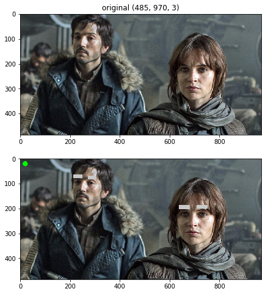

This lab will exercise your understanding of face detection and AR markers. You
will be working with a video stream, so we will **not** use a jupyter notebook.
Unfortunately jupyter is not good with live video, however, they are working on
on adding that feature.

{width=60%}

You are going to build a python program that will manipulate a video stream from
your laptop and do:

- watch for movement (change detection)
- detect faces/eyes
- draw funny things on people (nothing inappropriate)
- detect AR markers
- indication whether it is currently detecting faces or not
- **[Bonus]** do star wars stuff

# Displaying Video in Python

Since we are not using a jupyter notebook for this, you need to be able to
display video in a window when running python from the command line. Here is
some code from lesson 11 to get you started:

```python
#!/usr/bin/env python

from __future__ import print_function
from __future__ import division
import cv2
import time

def detectChange(img):
    pass

def findFaceEyes(img):
    pass

def drawFunny(img):
    pass

def starWars(img):
    pass

if __name__ == "__main__":
    # we want to capture the default camera: 0
    # if we had other cameras attached on USB ports, we could
    # pass in 1, 2, 3, etc to pick which one
    cam = cv2.VideoCapture(0)

    # loop forever
    while True:
        # reading the camera returns 2 things:
        #    good: was the image successfully captured - True/False
        #    img: if successful, then img is a good/valid image
        good, img = cam.read()
        if good:
            cv2.imshow('window title', img)  # you can name the
                                             # window anything
            key = cv2.waitKey(10)  # wait 10 ms. If you put 0, then
                                   # it will wait forever for a
                                   # key press.
            if key == ord('q'):
                break  # q = quit, break out of loop
        time.sleep(0.03)  # sleep for a little

    cam.release()  # close camera
    cv2.destroyAllWindows() # clean up GUI
```

# Lab 3

Create a python program (or separate programs) and do the following:

## [20 pts] Task 1: Change Detection

{width=50%}

1. Open a window and display the live camera feed
1. Check the image for change
   1. In a corner of the image put a marker, like a small red circle to indicate
   there is nothing there
1. Once there is movement/change, display only the change
   1. Update the marker in the corner to show you have detected change
   1. *Hint:* You might need some filtering/morphological ops to clean up the image

## [50 pts] Task 2: Face Detection

1. Using an OpenCV filter, find faces and eyes in each image when the image changes
1. Using the identified face/eye locations do two of these things
   1. Put glasses on each person using OpenCV drawing commands
   1. Put a hat on each person
   1. Draw funny eyebrows
      1. You can even animate them
   1. Something else ... if you have an idea ask your instructor first

## [30 pts] Task 3: AR Markers

1. Generate AR markers according to the libraries directions. Show
the image and the marker number in your video feed.
   1. *NOTE:* the library can only detect 1 marker in the image, no more
1. Change what you draw on people based on the AR marker, so you will need to
have a couple of them.

## [10 pts] Bonus

Instead of doing Task 2 like described, everything you do has to be tied to Star Wars, like:

- Put Darth Vader's, Boba Fett's, Jango Fett's, or a storm trooper's helmet on people
- Put one of [Queen Amidala](http://starwars.wikia.com/wiki/Padm%C3%A9_Amidala) crazy outfits, headdress, or hats on people.
- Use an AR marker to determine which outfit will go on people
- Something else ... if you have an idea ask your instructor first
