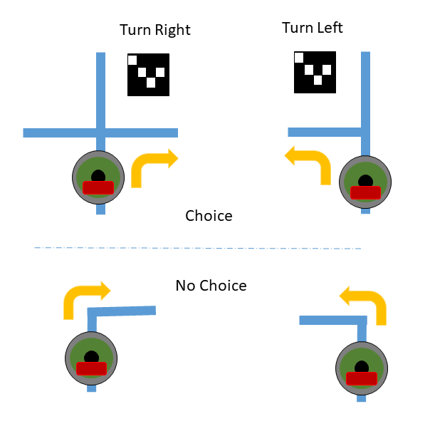

{width=33%}

# Final Project

This project is 20% of your final grade and will leverage your  ability to:

- Control the Roomba
- Navigate a maze
- Use computer vision

## Authorized Resources

You may only get help within your group or from the instructor. Do not talk to
other groups or other cadets about this lab.

# Working with the Roombas

When you work on the Roombas outside of class, you need to do 2 things:

1. Put the robot back on the charging stand when you are done, make sure charging
indicator is lit (there will be a red, yellow, or green LEDs that blinks).
1. Unplug the USB A end of the power cord from the Battery. **Don't** unplug
USB cable from the RPi, it seems more prone to break on that end. The battery
end of the cable seems sturdier.
1. Also, plug the Raspberry Pi battery into the USB charger. The blue LEDs on
the battery will blink when it is charging. There are 4 LEDs, if the battery is
full, then all 4 will be solid. If the battery is low, then 1 or more LEDs will
be off or blinking.
    1. Battery microUSB input plug to charge the battery
    1. iPad USB A output port goes to the RPi

Please keep everything charged, so you don't "Blue Falcon" another team who
needs to do work.

# [25 pts] Individual Score

You will take a 15 min written quiz based on the entire course. It will be similar
to the quizzes, GRs, and have lab content. There will be questions on Linux
commands and python programming.

Why??? Well, this is to make sure everyone has been learning the material. This
is the only way to separate out people who have not been doing group work ...
you know who you are.

# [10 pts] Robot Status/Debugging

Since multiple groups are using the robots, we need to be aware when things are
going bad or we need debugging info. Your robot must:

- Display AR markers found on the LCD for 3 seconds
- Every 1 minute (or so), update the LCD with the current battery voltage.

# [40 pts] Navigate the Maze

Your robot must be able to safely navigate the maze using the cliff and bump
sensors. The maze will be dynamic, so you cannot cheat like you can in ECE382
and just program your robot to go through the maze. The final maze will available
on lesson 40 and you will get 7 minutes per team to run through the maze.

The maze will be constructed as a series of lines. Use the robot's sensors to
find and track the lines. There will be intersections on the course. When the
robot detects an intersection, it must look for an AR code to tell it what to
do:

{width=50%}

- 1111: go straight
- 2222: go right
- 3333: go left
- 4000: stop/complete/end of course

Also when navigating the course, your robot *must*:

- If anything gets in the way of the robot, it must stop until the obstacle is removed
- If it finds a cliff, then it must stop and display *CLIF* on its LCD. It doesn't
have to do anything else at this point

## Notes

1. You have worked with the vision system and the AR marker code ... it is not always
robust. However, in the real world, nothing is. You must write your code to
compensate for this. Often engineers have to **think** about a situation and
develop solutions that overcome shortcomings with hardware and software.

# [25 pts] Robotic Pet

You will use vision techniques from the course to find and chase a ball. Your
robot *must* follow the ball when you roll it and always stay pointed at the
ball.

*Hint:* just roll the ball slowly so it goes about 7-10 ft and your robot must
follow it ... that is it. Don't throw it fast or the Roomba will loose track of
it.
