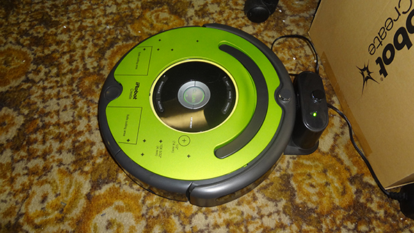

{width=33%}

# Final Project

This project is 20% of your final grade and will leverage your  ability to:

- Control the Roomba
- Navigate a maze
- Use computer vision

**Note, the highest grade you can get if you do the required work is 75% or a C+.
There are 2 additional timed events which worth 10 pts and 15 pts respectively.
If you achieve the task the fastest, you can earn the additional points ...
winner takes all for each additional task.**

## Authorized Resources

You may only get help within your group or from the instructor. Do not talk to
other groups or other cadets about this lab.

# Working with the Roombas

{width=400px}

When you work on the Roombas outside of class, you need to do 2 things:

1. Put the robot back on the charging stand when you are done, make sure the circular
knobby thing on the front is pointed at the charger base. Usually, some LED light
lights up showing it is charging. Sometimes not ... so just kind of move it around
a little to see if anything lights up.
1. Unplug the USB A end of the power cord from the Battery. **Don't** unplug
USB cable from the RPi, it seems more prone to breaking on that end. The battery
end of the cable seems sturdier.
1. Also, plug the Raspberry Pi battery into the USB charger. The blue LEDs on
the battery will blink when it is charging. There are 4 LEDs, if the battery is
full, then all 4 will be solid. If the battery is low, then 1 or more LEDs will
be off or blinking.
    1. Battery microUSB input plug to charge the battery
    1. iPad USB A output port goes to the RPi

Please keep everything charged, so you don't "Blue Falcon" another team who
needs to do work.

# [5 pts] Task 1: Robot Debugging

Since multiple groups are using the robots, we need to be aware when things are
going bad or we need debugging info. Write a simple program that:

- Displays AR marker found in an image (or none if no marker) on the LCD for 3 seconds
- Displays the current battery charge for 3 seconds
- Display the which of the cliff sensors is detecting tape for 3 seconds

Although not required for the remaining tasks, I suggest you incorporate these
into your code for the remaining tasks. *If you have issues with the light bump sensors*,
you could do a similar debug with them like we did with the cliff sensors above.

Now other methods of debugging, like printing sensor readings out to the command line
using `print()` might also be useful. Try to solve this problem and use what we
have learned in class to solve it.

## LCD Commands

To display letters to the 7 segment LEDs, use the `Create2` class method:

```python
Create2.digit_led_ascii(display_string)

# not a complete example, but basically:
bot = Create2()
bot.digit_led_ascii('hi')  # a max of 4 letters, since there are only 4 LEDs
```

# [30 pts] Task 2: Navigate the Maze

Your robot must be able to safely navigate the maze using the cliff and bump
sensors. The maze will be dynamic, so you cannot cheat like you can in ECE382
and just program your robot to go through the maze. The final maze will available
on lesson 40 and you will get 7 minutes per team to run through the maze.

The maze will be constructed as a series of lines. Use the robot's sensors to
find and track the lines. There will be intersections on the course. When the
robot detects an intersection, it must look for an AR code to tell it what to
do:

{width=50%}

- 1111: go straight
- 2222: go right
- 3333: go left
- 4000: stop/complete/end of course

Also when navigating the course, your robot *must*:

- If anything gets in the way of the robot, it must stop until the obstacle is
gone. It must also display *OBST* on the LCD.
- If it finds a cliff, then it must stop and display *CLIF* on its LCD.

## Safety

Since there may be more than one robot on the course at a time, if your robot
detects objects using either the light bump sensors or physical bump sensors
(`bumps_wheeldrops`), then the robot should stop until the obstacle is gone.
This `namedtuple` contains the left/right bump sensor values. So when you call
`get_sensors()`, you can access these values by this example here:

```python
# Note: the Create2() already does most of this for you, but when you call
# the function get_sensors(), the dictionary will include a variable called
# bumps_wheeldrops
>>> from collections import namedtuple
>>> BumpsAndWheelDrop = namedtuple('BumpsAndWheelDrop', 'bump_left bump_right wh
eeldrop_left wheeldrop_right')
>>>
>>> bumps_wheeldrops=BumpsAndWheelDrop(True, False, True, False)  # I set them to T and F
>>> bumps_wheeldrops
BumpsAndWheelDrop(bump_left=True, bump_right=False, wheeldrop_left=True, wheeldr
op_right=False)
>>> bumps_wheeldrops.bump_left  # this should be True
True
>>> bumps_wheeldrops.bump_right  # this should be False
False
```

## Notes

1. You have worked with the vision system and the AR marker code ... it is not always
robust. However, in the real world, nothing is. You must write your code to
compensate for this. Often engineers have to **think** about a situation and
develop solutions that overcome shortcomings with hardware and software/firmware.

# [20 pts] Task 3: Navigate

Now, redo task 2, but incorporate the path finding code, or devise your own method,
so that when the robot finds an obstacle, it must find a new route to the end point.
You will have to develop a digital map and the robot must figure out where it is
in the map on its own to find a new route.

# [20 pts] Task 4: Robotic Pet

You will use vision techniques from the course to find and chase a ball. Your
robot *must* follow the ball when you roll it and always stay pointed at the
ball.

*Hint:* just roll the ball slowly so it goes about 7-10 ft and your robot must
follow it ... that is it. Don't throw it fast or the Roomba will loose track of
it.

# Bonus [10 pts]

On lesson 39 there will be a new maze, be the fastest through the maze doing task 2.
If no one is able to complete the Task 2, then no extra points will be awarded.

# Bonus [15 pts]

On lesson 40 there will be a new maze, be the fastest through the maze doing task 3.
If no one is able to complete the Task 3, then no extra points will be awarded.
