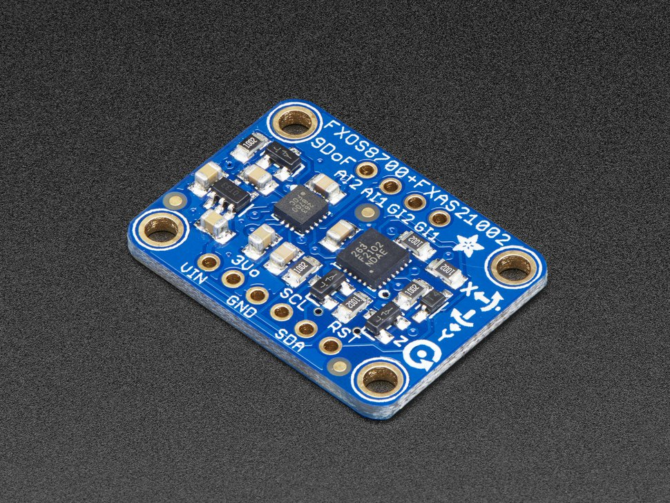

# Sensor Calibration

{width=50%}

In this lab you will calibrate the inertial measurement unit (IMU)^[https://en.wikipedia.org/wiki/Inertial_measurement_unit]
on your roomba. Below, is a suggested timeline for completing the required
tasks. All 3 tasks must be completed by the end-of-class on the second day
of lab.

You should learn or gain experience with:

- How IMU's work
- How to calibrate a basic robotic sensor
- Commanding the roomba to follow a pre-defined heading

**WARNING:** If you drop/damage the roomba, you automatically fail the lab.
There are not enough robots available if we start damaging them.

## Authorized Resources

You may only get help within your group or from the instructor. Do not talk to
other groups or other cadets about this lab.

# [0 pts] Pre-lab

There is a lot to do in this lab. It would be wise to show up on Day 1 with your
**notebook already setup**, so all you have to do is collect data and drop it in.
Also, start writing the python program **before** you show up on Day 2. It could
take you a while to get it right.

# Day 1

## [50 pts] Task 1

The first part of the lab we will gather data. Use the python library
`the-collector` to save the data

```python
#!/usr/bin/env python

from __future__ import print_function, division
import nxp_imu
from the-collector.bagit import BagWriter
import time

if __name__ == "__main__":
	imu = nxp_imu.IMU()
	bag = BagWriter()
	bag.open(['accel', 'mag', 'gyro'])

	for i in range(1000):
		a,m,g = imu.get()  # grab data

		# save data
		bag.push('accel', a)
		bag.push('mag', m)
		bag.push('gyro', g)

		time.sleep(1/20)  # grab data at 20 Hz

	bag.write('imu.json')  # you can call this file anything you want
	print('Done ...')
```

- You need to determine the biases for the IMU. You will use the RISC (Roomba
IMU Sensor Calibrator) and spin it gently (~1/4 - 1/2 revolution per second)
around while gathering IMU data. Do a good 2-3 full revolutions in both the
clockwise and counter clockwise directions, so you have plenty of data.

Also, most modern cell phones have a digital compass in them. Actually they may
have the same IMU we are using in them, since this is a cell phone IMU. Use your
compass to calculate the start/stop orientation of your Roomba. Remember, the
x-axis (forward) points out the front.

- After you have save the data successfully, take a look at the data on the command
line: `cat imu.json` or whatever you called the file.

- You will notice that the data is all text.

- Next, plot the raw data like we did in class for the IMU (all 3 sensors).
Does it look the same?

## [40 pts] Task 2

Follow the same process we did in class to determine the biases of the IMU for the
accelerometer and the magnetometer. Once you have the biases, apply them to the
data and re-plot the accelerometer/magnetometer and calculate the orientations.
You should see plots like we produced in class.

# Day 2

## [10 pts] Task 3

Demonstrate to your instructor the IMU's heading verse the compass heading on your
cellphone. They should be close, but won't be the same.

Now that you have a good compass, pick a heading and run the Roomba along the
length of the hallway. Note, there may still be some difference between your IMU
and the cell phone's interpretation of the compass direction. Your cell phone could
be correcting for the difference between true North and magnetic North. It could
be around 8-10 degrees depending on a variety of factors.

**Also**, the Roomba's motors generate a magnetic field that can influence the
compass too. In a real application, you would also calibrate the compass for the
effects of the motor's magnetic field. However, that is a lot of work and we
should be able to get close doing it this way.

# Turn In

When you are done, print out and turn in your `jupyter notebook` showing *Task 2*
and *Task 3*.
