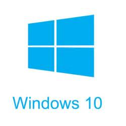

{width=1in}

# Setup

## Homebrew^[https://brew.sh/]

We will use `homebrew` to install the software:

```bash
	brew update
	brew install pandoc
	brew install caskroom/cask/basictex
```

Now `basictex` installs 90 MB of basic latex software. If you want or need more,
you can try install `mactex`, however, it is about 2.9 GB of data and takes a
while to install. Once `basictex` is installed, you need to add it to your path:

```bash
	export PATH=$PATH:/Library/TeX/texbin
```

Also, run:

```bash
	tlmgr install collection-fontsrecommended
```

## Pandoc^[http://pandoc.org/]

Now `pandoc` has its own flavor of Markdown^[http://pandoc.org/MANUAL.html#pandocs-markdown]
that accepts latex equations and other formatting directives not usually found
in Markdown. Some things I like about it are:

- Set image size by appending `{width=x height=y}` to the end of an image command
	- Example: `{width=50%}`
- Latex equation commands
	- `\begin{eqnarray} ... \end{eqnarray}`
	- In line equations: `$\theta$`
	- `\newcommand ...`

All most all of the pdfs are built using:

```bash
	pandoc filename.md -V geometry:margin=1in -N -s  -o filename.pdf
```

where:

- `-V geometry:margin=1in` sets a 1 in margin all the way around
- `-N` puts numbers on the paragraphs
- `-s` makes the document a stand alone document, so it adds things like page numbers
- `-o filename.pdf` tells pandoc to output a pdf using `pdflatex` on macOS

## Windoze Setup

{width=1in}


### Zip

Install [7-Zip](http://www.7-zip.org/) from the website. This has a command line
ability. Now setup your bash environment with:

    alias zip="/c/Program\ Files/7-Zip/7z.exe a"
    export PATH=$PATH:"/c/Program Files/7-Zip"

So the nice thing here is, when you call `zip -r files.zip folder` in your linux/unix
bash script, here on Windoze, the command will call `7z` and have it act just like
`zip` on linux/unix.

### Pandoc

Install from [pandoc website](http://pandoc.org/installing.html). You will also
have to install MiKTeX, but the directions are on the pandoc install website too.
MiKTeX installs the software necessary to To set up the environment do:

    export PATH=$PATH:"/c/Users/Kevin.Walchko/AppData/Local/Programs/MiKTeX 2.9/miktex/bin/x64"


# Github

## Automatic Generation

Using Travis-CI, travis can automagically build the website every time you push
code. Here are some details:

- Setup the `.travis.yml`, like it is in the root directory
- Generate a [Personal Access Token](https://docs.travis-ci.com/user/deployment/pages/) on github
- Add it to your travis account settings by setting [environment variable](https://docs.travis-ci.com/user/environment-variables#Defining-Variables-in-Repository-Settings) called GITHUB_TOKEN with a value of the personal access token (lots of numbers)

## Manual Generation

Not sure the automatic is really required. You can disable it in the `.travis.yml`
file and then run the following from the `website` directory:

- `./build.py` which builds the entire website and stores it in `www`
- `./deploy.py` which pushes everything in `www` to the repo `gh-pages` branch
of the website
